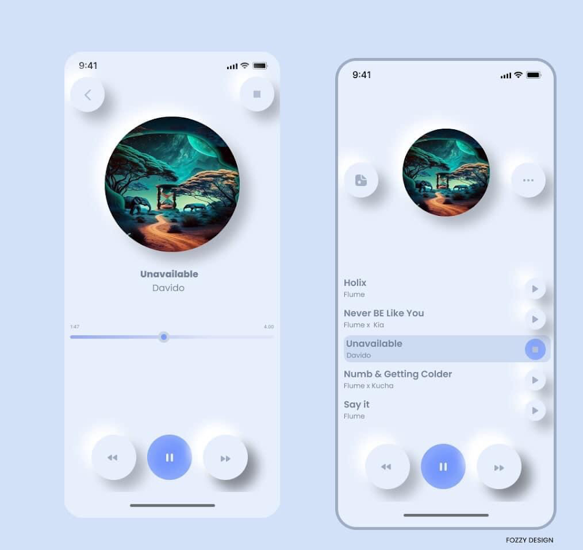

# 🎵 Music UI – Flutter App

A modern and elegant **Music Player UI** built using **Flutter**.  
This project focuses on delivering a clean, smooth, and visually appealing interface for music applications.

---

## 🚀 Features

- 🎨 Beautiful and minimal UI design  
- 📱 Fully responsive layout  
- 🔊 Music player screen (play, pause, progress bar UI)  
- 🎼 Playlist & album section design  
- ⚡ Clean widgets structure  

---

## 📸 Screenshot

---

## 🛠️ Tech Stack

- **Flutter**
- **Dart**
- **Material Design Components**

---

